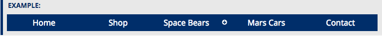
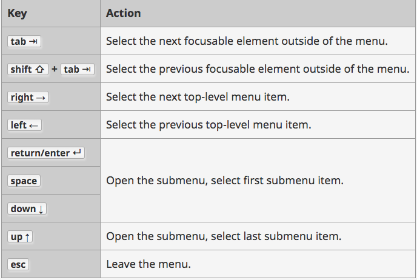
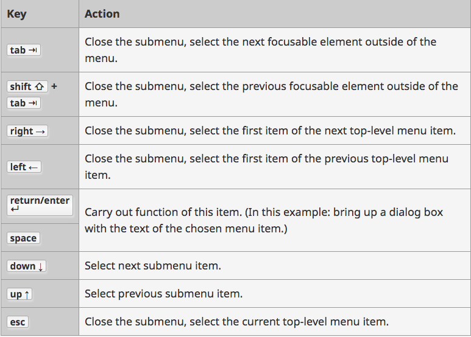
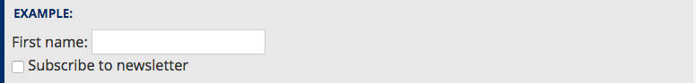
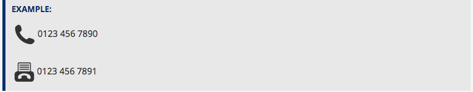
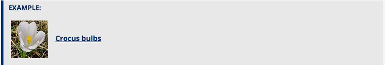
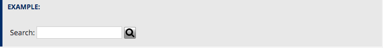
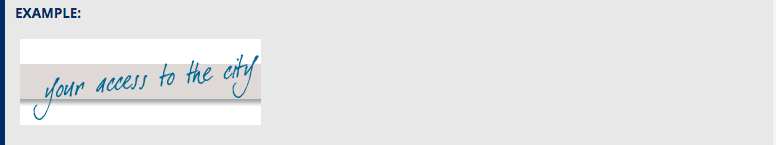
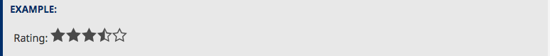

## Keyboard Users:

Submenus should not open when using the tab key to navigate through the menu, as keyboard users would then have to step through all submenu items to get to the next top-level item. Instead, consider one of the following approaches.

## Use parent as toggle:

Use this approach in situations where the parent menu item only summarizes the submenu and doesn’t have to carry out a function, such as linking to a web page. In this case, the submenu is opened by a script when the user activates the top-level item and closed when the focus leaves the submenu.
The following code iterates through all top-level items with the class has-submenu and adds a click event, which opens or closes the submenu depending on its state. Also, the aria-expanded attribute is set to true while the submenu is open, and to false otherwise.

```
var menuItems = document.querySelectorAll('li.has-submenu');
Array.prototype.forEach.call(menuItems, function(el, i){
	el.querySelector('a').addEventListener("click",  function(event){
		if (this.parentNode.className == "has-submenu") {
			this.parentNode.className = "has-submenu open";
			this.setAttribute('aria-expanded', "true");
		} else {
			this.parentNode.className = "has-submenu";
			this.setAttribute('aria-expanded', "false");
		}
		event.preventDefault();
		return false;
	});
});

```
## Use button as toggle:

For situations when the parent menu item needs to carry out a function, such as linking to a web page, a separate button can be added to the parent item, to open and close the submenu. This button can also act as a visual indicator for the presence of a submenu.



```
var menuItems = document.querySelectorAll('li.has-submenu');
Array.prototype.forEach.call(menuItems, function(el, i){
	var activatingA = el.querySelector('a');
	var btn = '<button><span><span class="visuallyhidden">show submenu for “' + activatingA.text + '”</span></span></button>';
	activatingA.insertAdjacentHTML('afterend', btn);

	el.querySelector('button').addEventListener("click",  function(event){
		if (this.parentNode.className == "has-submenu") {
			this.parentNode.className = "has-submenu open";
			this.parentNode.querySelector('a').setAttribute('aria-expanded', "true");
			this.parentNode.querySelector('button').setAttribute('aria-expanded', "true");
		} else {
			this.parentNode.className = "has-submenu";
			this.parentNode.querySelector('a').setAttribute('aria-expanded', "false");
			this.parentNode.querySelector('button').setAttribute('aria-expanded', "false");
		}
		event.preventDefault();
	});
});

```
## Keyboard behavior:

Web application menus are expected to work like desktop application menus. For example, the left and right keys are used to iterate through the top-level items, and the up and down arrows are used to navigate submenus. Pressing the tab key focuses the next item after the menu instead of the next menu item.

To allow focus to be set to menu items by keyboard, the items are given a tabindex attribute with the value -1. The first main menu item (“File” in this example) is assigned a tabindex value of 0 which adds it to the tab order and lets the user access the menu using the keyboard.

```
Array.prototype.forEach.call(appsMenuItems, function(el, i){
		if (0 == i) {
			el.setAttribute('tabindex', '0');
			el.addEventListener("focus", function() {
				currentIndex = 0;
			});
		} else {
			el.setAttribute('tabindex', '-1');
		}
});

Array.prototype.forEach.call(subMenuItems, function(el, i){
	el.setAttribute('tabindex', '-1');
});

```
## Top-Level Menu Items
The following table summarizes the typical behavior of top-level menu items:

Key mapping for top-level menu items



## submenu Items

The following table summarizes the typical behavior of submenu items:

Key mapping for submenu items



## Meaningful text labels:

UI control text labels are very useful to all users, but getting them right is particularly important to users with disabilities.
You should make sure that your button and link text labels are understandable and distinctive. Don't just use "Click here" for your labels, as screenreader users sometimes get up a list of buttons and form controls. 

Form labels are also important, for giving you a clue what you need to enter into each form input.



```
<div>
<label for="firstname">First name:</label>
<input type="text" id="firstname" name="firstname">
<input type="checkbox" name="subscribe" id="subscribe">
<label for="subscribe">Subscribe to newsletter</label>
</div>
```
## Hiding the label element:

In this approach, the `<label>` element is provided to identify a form control within the code, but it is visually hidden to avoid redundancy for users who can derive the purpose from the visual cues
```
<label for="search" class="visuallyhidden">Search: </label>
<input type="text" name="search" id="search">
<button type="submit">Search</button>
```
## Using aria-label:

The aria-label attribute can also be used to identify form controls. This approach is well supported by screen readers and other assistive technology, but, unlike the title attribute (see below), the information is not conveyed to visual users. The approach should therefore only be used when the label of the control is clear from the surrounding content, like the button in the example below.

```
<input type="text" name="search" aria-label="Search">
<button type="submit">Search</button>

```
## Using aria-labelledby

The aria-labelledby attribute can also be used to identify form controls. This approach is well supported by screen readers and other assistive technology, but, unlike the title attribute (see below), the information is not conveyed to visual users. The approach should therefore only be used when the label of the control is clear from the surrounding content, like the button in the example below.

The id of the element containing the label text is used as the value of the aria-labelledby attribute.

```
<input type="text" name="search" aria-labelledby="searchbutton">
<button id="searchbutton" type="submit">Search</button>

```
## Using the title attribute:

The title attribute can also be used to identify form controls. This approach is generally less reliable and not recommended because some screen readers and assistive technologies do not interpret the title attribute as a replacement for the label element, possibly because the title attribute is often used to provide non-essential information. The information of the title attribute is shown to visual users as a tool tip when hovering over the form field with the mouse.

```
<input title="Search" type="text" name="search">
<button type="submit">Search</button>

```
## Accessible data tables:

There is no way for a screenreader user to associate rows or columns together as groupings of data. To do this you need to know what the header rows are, and if they are heading up rows, columns, etc. This can only be done visually for the above table (see bad-table.html and try the example out yourself).

* Table headers are defined using`<th>`elements — you can also specify if they are headers for rows or columns using the scope attribute. This gives you complete     groups of data that can be consumed by screen readers as single units.

* The `<caption>`element and `<table>` summary attribute both do similar jobs — they act as alt text for a table, giving a screen reader user a useful quick          summary of the table's contents. `<caption>` is generally preferred as it makes it's content accessible to sighted users too, who might also find it useful. You     don't really need both.


## Images Concepts:

Images must have text alternatives that describe the information or function represented by them. This ensures that images can be used by people with various disabilities.

## Types of images:

## Informative Images:

Informative images convey a simple concept or information that can be expressed in a short phrase or sentence. The text alternative should convey the meaning or content that is displayed visually, which typically isn’t a literal description of the image.

This example shows two image icons – one of a telephone, one of a fax machine. A phone number follows each image. Consistent with the visual presentation, the text alternatives “Telephone:” and “Fax:” are used to identify the device associated with each number.



```
<p>
   0123 456 7890
</p>
<p>
   0123 456 7891
</p>

```

## Decorative Images

Decorative images don’t add information to the content of a page. For example, the information provided by the image might already be given using adjacent text, or the image might be included to make the website more visually attractive.

In these cases, a null (empty) alt text should be provided (alt="") so that they can be ignored by assistive technologies, such as screen readers



```
<a href="crocuspage.html">
	
	<strong> Crocus bulbs</strong>
</a>

```

## functional Images

Functional images are used to initiate actions rather than to convey information. They are used in buttons, links, and other interactive elements. The text alternative for the image should convey the action that will be initiated (the purpose of the image), rather than a description of the image. For instance, as shown in examples below, the text alternative should be “print this page” rather than “(image of a) printer”, “search” rather than “magnifying lens”.



```
<input type="image" src="searchbutton.png" alt="Search">

```

## Images of Text

Images of text display text that is intended to be read. With the current CSS capabilities in most web browsers, it is good design practice to use actual text that is styled with CSS rather than image-based text presentation. Genuine text is much more flexible than images: It can be resized without losing clarity, and background and text colors can be modified to suit the reading preferences of users. Images are more likely to distort and pixelate when resized. In those rare situations where images of text must be used, the text alternative must contain the same text presented in the image.



```


```

## Groups of images

Sometimes groups of images are used together to represent one piece of information. For example, a collection of star icons that together represent a rating. In this case, only one of the images needs a text alternative to describe the entire collection, while the other images have a null (empty) alt attribute so that they are ignored by assistive technology.

In other cases, a group of images may represent a collection of related images. For example, showing a collection of art impressions that are thematically related. In this case, each image needs its text alternative that describes it individually, as well as its relationship within the group.



```
Rating:


```
## Buttons:

In most cases, for the greatest clarity, use `<button>` elements for clickable areas.

###Best Practices

Avoid using `<div>` or `` tags to create buttons. Screen readers generally won’t know that either is a usable button.

If you must use a different HTML element to do the same functionality as a button, use the aria role='button' to let screen readers know the area is clickable.
You can also use an input for a button (especially used in forms) as long as it has a type='button'.

```  
<div role='button'>
    Open Modal
</div>

```

```
<input type='button'> Click me </input>

```
## Serach bar

On many websites, search bars or search inputs serve as a way to find results for something on a very large or complex site. They are often used in lieu of extensive navigation as the user attempts to find a quick answer to a very specific query.

Search bars can be a way for users of assistive technology to quickly find answers without tabbing through the navigation or reading all the content of a web page. Making a skip link to your site’s search bar may even be advisable if that is a way you can simplify the experience of accessible users.

### Best Practices

* Refer to the forms and form validation section to get the best practices for form, label, and input elements.

* A search bar should be set up in a form as paired label and input.

* Using a submit button to search decreases the number of keystrokes necessary to use the form.

* Always include an ARIA role='search' somewhere on the form or fieldset.

* Also, always include the word ‘search’ in the label somewhere (you can visually hide it, though) and in the submit button.

* For the search input, you could technically use the type='search', but the following accessible websites use type='text' instead:

    * Perkins School for the Blind 

    * Freedom Scientific

    * Simply Accessible

```
<form role='search' action="/" method="get">
  <label for='header-search'>
    <span class='visually-hidden'>Search</span>
  </label>

  <input type='text' id='header-search'/>

  <button type='submit'>
    <span class='visually-hidden'>Submit Search</span>
  </button>
</form>

```
## Tabs

Tabs, which are very similar to accordions, are also common web design structures used to organize and hide content, so as not to overwhelm the user. Tabs also additionally require JavaScript to show/hide things based on a user click or focus event.

The key to making tabs accessible is to toggle CSS display properties and some ARIA states on user click or focus events (e.g. toggle aria-selected, tabindex, and display:none/block; and/or aria-hidden='true/false').

## Best Practices

Tabbed content usually consist of two main parts. First, they consist of the tabs themselves that control the visibility of some area of content below. Second is the content controlled by the tabs. In general, we refer to the former as tabs, and the latter as tab panels.

## Tab Controls

* Each tab control is set up as a link inside an unordered list structure. The unordered list should have an aria `role='tablist'`. Using links rather than buttons for tab controls seems to be common practice, though we could see an argument made for making tab controls buttons instead.

* All the tab controls have an aria `role='tab'`.

* Each tab control has a unique id and href which is associated with a tab panel’s id.

* Each tab link also has a unique aria-controls attribute which references its tab panel’s id ({name-of-fruit}).

* Every tab control has an aria-selected attribute that is set to either true or false. If true, the tab control has been clicked or focused on, and the tab panel    associated with it should be visible. If false, the tab control is not selected, and its corresponding tab panel is hidden.

* Also, for the tab controls that are not currently selected, we place `tabindex='-1'` on them to take them out of the tab order. If there are 10-12 tab controls     on your web page, user’s of assistive technology will now not have to tab through all of them to reach the content in the tab panel.

## Tab Panels

* A CSS class of .hidden or .current is toggled on each tab panel when the active tab control changes focus, so that when a panel should be hidden,`display: none;`   is applied to the panel, and when it should be visible, `display: block;` is applied instead. When a panel has display: none; applied, the tab panel is neither     visible nor perceivable by screen reader, and assistive technologies will skip over this content.

* All the tab panels have an aria `role='tabpanel'`.

* Each tab panel also has an `aria-labelledby` attribute which serves a similar purpose to how the `aria-controls` acted in our accordions example.

* The `aria-labelledby` attribute is set to the id of the corresponding tab control, such as: `aria-labelledby='tab-{#}'` to give users of assistive technology a       more comprehensive idea of how the tabs and tab panels are linked.

## Links

### Best Practices

### Link text: 
* Make the link text describe its purpose and destination. If you are linking to something from an image or icon, supply a title attribute to give people who use     screen readers some context.

### Link styling: 
* To clearly indicate links, underline them when possible. There should be some visual state change other than color when hovering or focusing on links. Do not       rely on color or color changes alone to indicate links.

### Navigation: 

* Users should be able to tab to navigate between links, and active a link by pressing “Enter” on the keyboard. They should be able to activate hover and focus       states with either a mouse or a keyboard.

### Linked Images: 

* Images that are used as the link text for a link should have especially descriptive alt text, as it will be used as the link text for the link by screenreaders.    The text of the image’s alt attribute, followed by the word “link” will be announced as the link text for the link.

### New window or tab:

* If a link opens a new tab, or takes the user out of the current format or application, that action should be indicated by the link text. It can be disorienting     to users – especially those with cognitive, sight, or mobility problems – to unexpectedly open an item in a new format or application. Indicate either via          contextual text near the links, or (preferably) with very clear link text, where links lead, and how they will open. If you need to add contextual text to the      link text, consider using a nested tag that is visually hidden for sighted users. An example is given below.
```
<a target='_blank' href='searchresults.com'>
  Search results!
  <span class='screenreader-text'>(Link opens in a new tab)</span>
</a>

```
## Multimedia:

Multimedia is anything that uses audio and video. It’s important to provide ways for everyone to consume that media.

### Best Practices:

### Auto-play:

Don’t auto-play videos and audio. People using screen readers navigate by listening, so any sound playing when the page loads will interfere with their             experience. Audio or video should only be initiated by an action taken by the user. If your web page does automatically play audio for more than 3 seconds,         provide a mechanism to pause or stop the audio.
    
### Closed captioning and descriptions: 

Provide captions or transcripts for audio and video. Anything said in multimedia must be said in the captioning, and vice versa. Any information displayed solely visually should also be available in audio or text form.

### Timestamping and keyboard:

All video controls should be accessible via the keyboard, including time stamp information.
Alerts: Don’t rely on sounds to convey information, like an “alert” noise. Even users who have good hearing often have their computers muted.

## Maps

Road maps can present accessibility challenges. In the best practices below, we are addressing ways to improve the accessibility of road maps. Floor plans present a different set of challenges, and can best be handled by in-person assistance, or perhaps a 3D model.

### Best Practices

### Text-based directions:
If the map is used to provide directions to a location, make sure to also provide text-based directions, or a link to text-based directions adjacent to the map.

### Alt attributes: 

If you are using a static image for the map, make sure to include a descriptive alt tag. Embedded maps, such as Google Maps, should include a title attribute. (See below for an example).

### Multiple locations: 

If you are using a map to display multiple locations, provide a text list of locations.

### Color and contrast: 

If a map includes color coded regions, make sure that there is sufficient contrast between the text and the background, and that color coding is accessible for users with color-deficient vision. A good test is to see if the map is still usable in black and white.

### Consistency and simplicity: Keep maps consistent and simple in their styling.

### 3D or tactile version: You may want to have a tactile map available for non-sighted users.

### Google Maps

An embedded Google Map alone is not screen reader accessible. When using Google Maps, follow these tips:

### Descriptive heading:

Include a heading right before the map iFrame which describes the purpose of the map.
Determine the purpose of the map: If the map is on the page to show landmarks, describe those landmarks and their locations, either in an unordered list or a paragraph. If the map is to show directions, then those directions should be spelled out in basic, text-based directions.
Title attribute: A Google Map is typically embedded within an iFrame. Make sure the iFrame includes a title attribute.


[Reference for Accessibility principles](https://www.w3.org/WAI/fundamentals/accessibility-principles/)

[Mozilla guide for Web Accessibility](https://developer.mozilla.org/en-US/docs/Web/Accessibility)