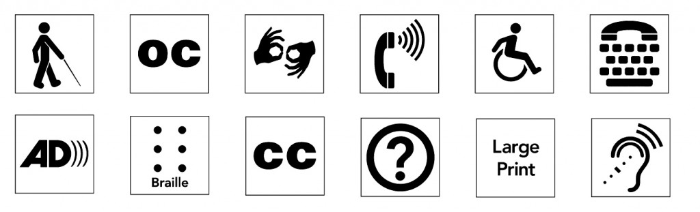
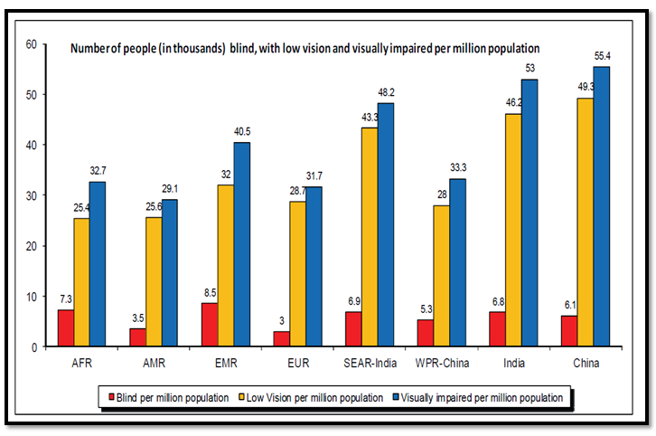
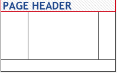
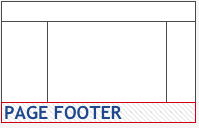
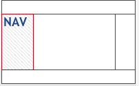
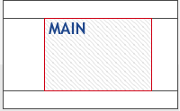
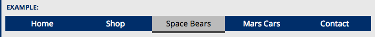

## What is Accessibility:

Accessibility is the practice of making your websites usable by as many people as possible — we traditionally think of this as being about people with disabilities,but really it also benefits other groups such as those using mobile devices, or those with slow network connections.
You could also think of accessibility as treating everyone the same, and giving them the same opportunities, no matter what their ability or circumstances. In the same way that it is not right to exclude someone from a physical building because they are in a wheelchair (public buildings generally have wheelchair ramps or elevators these days), it is also not right to exclude someone from a website because they have a visual impairment. We are all different, but we are all human, and therefore have the same (human) rights.

## What is Disability And Types

Disability simply means a situation or condition that hinders you from doing something you could easily do if you are not in that condition.

 

## There are three Modes of Disability:

### Permanent Disability:
This is when you are completely disabled. 

### Example: 
* auditory
* cognitive
* neurological
* physical
* speech
* visual

### Temporary Disability: 
This is simply a physical or mental disability which hinders your discharging of responsibilities for a short period of time.
### Example: 
people with “temporary disabilities” such as a broken arm or lost glasses

### Conditional or Situation Disability: 
This is simply when you are not able to do things due to the situation you find yourself in. Example: slow internet connection.
### Example:
* people with “situational limitations” such as in bright sunlight or in an environment where they cannot listen to audio
* people using a slow Internet connection, or who have limited or expensive bandwidth

## Why Web Accessibility is Important

The Web and Internet in whole is an increasingly important resource in many aspects of our life which includes: education, employment, government, commerce, health care, recreation, and more. It is important that the Web be accessible to everyone in order to provide equal access and equal opportunity to people with disabilities. An accessible Web can help people with disabilities participate more actively in society.

Also an accessible website is often the one of the easiest ways to do business with many people with disabilities, for instance, people who cannot read print material, people who have difficulty going to a physical store or mall, and others. Furthermore, what you do for accessibility overlaps with other best practices such as mobile Web design, usability, and search engine optimization (SEO)

An accessible website gives the access to information and interaction for many people with disabilities. That is, the accessibility barriers to print, audio, and visual media can be much more easily overcome through Web technologies.

I suggest reading “Social Factors in Developing a Web Accessibility Business Case for Your Organization” which shows how the Web impacts the lives of people with disabilities and Web accessibility as an aspect of corporate social responsibility.

Another important consideration for organizations is that Web accessibility is required by laws and policies in some cases. WAI Web Accessibility Policy Resources links to resources for addressing legal and policy factors within organizations, including a list of relevant laws and policies around the world.

 

 ## Accessiblity Standards

 Web Content Accessibility Guidelines (WCAG) is developed through the W3C process in cooperation with individuals and organizations around the world, with a goal of providing a single shared standard for web content accessibility that meets the needs of individuals, organizations, and governments internationally.

The WCAG documents explain how to make web content more accessible to people with disabilities. Web “content” generally refers to the information in a web page or web application, including:

* natural information such as text, images, and sounds
* code or markup that defines structure, presentation, etc.

## WCAG 2.0 and 2.1

WCAG 2.0 was published on 11 December 2008. WCAG 2.1 was published on 5 June 2018.

All requirements (“success criteria”) from 2.0 are included in 2.1. The 2.0 success criteria are exactly the same (verbatim, word-for-word) in 2.1.

There are additional success criteria in 2.1 that are not in 2.0. They are introduced in What’s New in WCAG 2.1.

Content that conforms to WCAG 2.1 also conforms to WCAG 2.0. (This is often called “backwards compatible”.) A website that meets WCAG 2.1 should meet the requirements of policies that reference WCAG 2.0.

To put it another way: If you want to meet both WCAG 2.0 and WCAG 2.1, you can use the 2.1 resources and you don’t need to bother looking at 2.0.

WCAG 2.0 and WCAG 2.1 are both existing standards. WCAG 2.1 does not deprecate or supersede WCAG 2.0. W3C encourages you to use the most recent version of WCAG when developing or updating content or accessibility policies.

## Who WCAG is for
### WCAG is primarily intended for:

Web content developers (page authors, site designers, etc.)
Web authoring tool developers
Web accessibility evaluation tool developers
Others who want or need a standard for web accessibility, including for mobile accessibility
Related resources are intended to meet the needs of many different people, including policy makers, managers, researchers, and others.

WCAG is a technical standard, not an introduction to accessibility.

## WCAG is separated into three conformance levels:

* Level A – some impact on design

  [Example reference for LEVLE A](https://www.w3.org/WAI/WCAG2A-Conformance)

* Level AA – medium impact on design

  [Example reference for LEVLE AA](https://www.w3.org/WAI/WCAG2AA-Conformance)

* Level AAA – high / extreme impact on design

  [Example reference for LEVLE AAA](https://www.w3.org/WAI/WCAG2AAA-Conformance)

## For example 

let's take guideline 1.4 (Distinguishable), which is about making it easier for users to see and hear content including separating foreground from background.

Success Criterion 1.4.1 is about the Use of Color. The rule goes like this: Color is not used as the only visual means of conveying information, indicating an action, prompting a response, or distinguishing a visual element. (Level A)

Success Criterion 1.4.3 is about Contrast (Minimum). The rule goes like this: The visual presentation of text and images of text has a contrast ratio of at least 4.5:1, except for the following: (Level AA)

And finally, success criterion 1.4.6 is about Contrast (Enhanced). And the rule goes like this: The visual presentation of text and images of text has a contrast ratio of at least 7:1, except for the following: (Level AAA)

As you can see, the more higher we get, the more demanding it becomes and the more pressure it put on how things can be presented in the web page.

As a rule of thumb, success criteria from level A should be invisible or barely noticeable to the interface. On the other hand, level AAA will have such a high impact on design, that even the W3C claims that most organizations will not be able to achieve that level (as the compromises on design will be too important):

  [Source (WCAG 2.0) - from the W3C](http://www.w3.org/TR/WCAG20/#conformance-reqs)

## Note

It is not recommended that Level AAA conformance be required as a general policy for entire sites because it is not possible to satisfy all Level AAA Success Criteria for some content

## Accessibility and the best practices it entail can benefit everyone:

* Semantic HTML (which improves accessibility) also improves SEO, making your site more findable/marketable.
* Caring about accessibility demonstrates good ethics/morals, which improves your public image.
* Other good practices that improve accessibility also make your site more usable by other groups, such as    mobile phone users, those on a low network speed, etc. 

## Good semantics:

We've already talked about the importance of good semantics, and why we should use the right HTML element for the right job. This cannot be ignored, as it is one of the main places that accessibility is badly broken if not handled properly.
Out there on the web, the truth is that people do some very strange things with HTML markup. Some abuses of HTML are due to legacy practices that have not been completely forgotten, and some are just plain ignorance. Whatever the case, you should replace such bad code wherever you see it, whenever you can.
Sometimes you are not always in the position to get rid of bad markup — your pages might be generated by some kind of server-side framework that you don't have full control over, or you might have third party content on your page (such as ad banners) that you don't have control over.
The goal isn't "all or nothing", however — every improvement you are able to make will help the cause of accessibility.
Text content:

One of the best accessibilities aids a screen reader user can have is a good content structure of headings, paragraphs, lists, etc.….
```
<h1>My heading</h1>

<p>This is the first section of my document.</p>

<p>I'll add another paragraph here too.</p>

<ol>
<li>Here is</li>
<li>a list for</li>
<li>you to read</li>
</ol>

<h2>My subheading</h2>

<p>This is the first subsection of my document. I'd love people to be able to find this content!</p>

<h2>My 2nd subheading</h2>

<p>This is the second subsection of my content. I think is more interesting than the last one.</p>
```


The screen reader reads each header out as you progress through the content, notifying you what is a heading, what is a paragraph, etc.
It stops after each element, letting you go at whatever pace is comfortable for you.
You can jump to next/previous heading in many screen readers.
You can also bring up a list of all headings in many screen readers, allowing you to use them like a handy table of contents to find specific content.

[Reference for semantic HTML for Web Accessibility](http://web-accessibility.carnegiemuseums.org/foundations/semantic/)

## Building keyboard accessibility back in:

Adding such advantages back in takes a bit of work (you can an example code in our fake-div-buttons.html example). Here we've given our fake `<div>`buttons the ability to be focused (including via tab) by giving each one the attribute tabindex="0":
Basically, the tabindex attribute is primarily intended to allow tabbable elements to have a custom tab order (specified in positive numerical order), instead of just being tabbed through in their default source order. This is nearly always a bad idea, as it can cause major confusion. Use it only if you really need to, for example if the layout shows things in a very different visual order to the source code, and you want to make things work more logically. 

### There are two other options for tabindex:

* tabindex="0" — as indicated above, this value allows elements that are not normally tabbable to become tabbable. This is the most useful value of tabindex.
* tabindex="-1" — this allows not normally tabbable elements to receive focus programmatically, e.g. via JavaScript, or as the target of links. 

[Reference for keyboard Accessibility](https://www.w3.org/WAI/perspective-videos/keyboard/)

## Page Structure:

Well-structured content allows more efficient navigation and processing. Use HTML and WAI-ARIA to improve navigation and orientation on web pages and in applications.

## Page header:

Most websites have a region at the top of every page that contains site-wide information, such as the website logo, search function, and navigation options. HTML5 provides the `<header>` element, which can be used to define such a region.

## Note:

If the `<header>` element is used inside `<article>` and `<section>` elements, it is not associated with the whole page, but only with that specific `<article>` or `<section>`.



```
<header>
  …
  
  …
</header>

```
## Page footer:

Similar to the page header, most websites also have a region at the bottom of every page that contains site-wide information, such as copyright information, privacy statements, or disclaimers. HTML5 provides the `<footer>` element, which can be used to define such a region.

## Note:

 If the `<footer>` element is used inside `<article>` and `<section>` elements, it is not identified as the footer for the whole page but only relates to that specific `<article>` or `<section>`.

 

 ```
<footer>
  …
  <p>&copy; 2014 SpaceBears Inc.</p>
  …
</footer>

 ```
## Navigation:

The HTML5 `<nav>` element can be used to identify a navigation menu. A web page can have any number of navigation menus. Use labels to identify each navigation menu.

 

 ```
<nav aria-label="Main Navigation">
  …
</nav>
…
<nav aria-labelledby="quicknav-heading">
  <h5 id="quicknav-heading">Quick Navigation</h5>
  …
</nav>

```
## Main content:

Use the HTML5 `<main>` element to identify the main content region of a web page or application.



```
<main>
  <h1>Stellar launch weekend for the SpaceBear 7!</h1>
  …
</main>

```
## Page Regions in HTML4 Using WAI-ARIA:

If HTML5 cannot be used or if an HTML4 page is retrofitted to improve accessibility, add WAI-ARIA code to div elements that function as their HTML5 counterparts, for example:

```
<div class="header" role="banner">…</div>
<div id="main" role="main">…</div>
<div id="nav" role="navigation">…</div>
<div id="footer" role="contentinfo">…</div>

```
   [Reference for for WAI-ARIA](https://www.w3.org/WAI/standards-guidelines/aria/)
## Headings:

Headings communicate the organization of the content on the page. Web browsers, plug-ins, and assistive technologies can use them to provide in-page navigation.

## Heading ranks:

Nest headings by their rank (or level). The most important heading has the rank 1 (`<h1>`), the least important heading rank 6 (`<h6>`). Headings with an equal or higher rank start a new section, headings with a lower rank start new subsections that are part of the higher ranked section.

Skipping heading ranks can be confusing and should be avoided where possible: Make sure that a `<h2>` is not followed directly by an `<h4>`, for example. It is ok to skip ranks when closing subsections, for instance, a `<h2>` beginning a new section, can follow an `<h4>` as it closes the previous section.

## Menus:

Menus are used for navigation and to provide functionality which are critical parts of web page operability.

## Menu Structure:

Semantic markup conveys the menu structure to users. Menus coded semantically can easily adapt to different situations, such as small screen displays, screen magnification, and other assistive technology.

Convey the menu structure, typically by using a list. Such structural information allows assistive technologies to announce the number of items in the menu and provide corresponding navigation functionality

* Unordered list

* Ordered list

## Label menus:

Label menus to make them easier to find and understand. Labels should be short but descriptive, to allow users to distinguish between multiple menus on a web page. Use a heading, aria-label, or aria-labelledby to provide the label.

```
<nav aria-labelledby="mainmenulabel">
	<h2 id="mainmenulabel" class="visuallyhidden">Main Menu</h2>
</nav>

```

## Indicate the current item:

Use markup to indicate the current item of a menu, such as the current page on a website, to improve orientation in the menu.

## Using invisible text:

Provide an invisible label that is read aloud to screen reader users and used by other assistive technologies to mark the current item which allows custom label text.
Remove the anchor (`<a>`), so users cannot interact with the current item. That avoids misunderstandings and emphasizes that the current menu item is active.

In the following example, the menu item has the invisible text “Current Page:” and the `<a>` element is replaced by a `<span>` with a class current:

```
<li>
    <span class="current">
        <span class="visuallyhidden">Current Page: </span>
		    Space Bears
	</span>
</li>

```
## Using WAI-ARIA:

Use the aria-current="page" attribute to indicate the current page in the menu. This technique is particularly useful when the anchor (`<a>`) cannot be removed from the HTML.

In the following example the link in the navigation points to the main content of the page.

```

<li>
	<a href="#main" aria-current="page">
	Space Bears
	</a>
</li>

```

## Menu Styling:

Clear and consistent styling allows users to find and recognize menus more quickly. Such styling includes consistency in the behavior, appearance, and relative location on pages across a website.

## Default state:

Use distinct styling to visually indicate menu items as regions of the page that can be activated. However, avoid exaggerated text decoration, such as words in upper case or small caps, as these make text harder to read.

## Hover and Focus states:

Change hovered or focused menu items, which gives users visual guidance when navigating the menu. In this example, hover and focus states use an inverted color scheme (blue on white instead of white on blue) and underline.

```

nav a:hover,
nav a:focus {
	color: #036;
	background-color: #fff;
	text-decoration: underline;
}

```
## Active state:

Indicate the menu item that was activated through clicking, tapping, or keyboard selection. Users can identify unintended activation, for instance when they have clicked on the wrong menu item. In this example, the active item has a darker blue background and an underline.

```
nav a:active {
	color: #fff;
	background-color: #024;
	text-decoration: underline;
}

```
## Current state:

Also visually indicate the current menu item in addition to the structural markup discussed in the previous section.

In this example, a different color combination (black on gray) and a bottom border were added to give the current menu item a distinct color and shape.

```
nav [aria-current=page] {
	background-color: #bbb;
	color: #000;
	border-bottom: .25em solid #444;
}

```
## Visited state:

For some types of menus, such as instructional steps, it may be useful to indicate menu items that a user had already visited. However, most menus are not expected to change based on the visited state.



## Flyout Menus:

Use fly-out (or drop-down) menus to provide an overview of a web site’s page hierarchy. It removes the need for multiple page loads provided that users know where to find the information. Application menus are usually implemented this way, too.

People with reduced dexterity, such as tremors, often have trouble operating fly-out menus. For some, it might be impossible. Make sure to provide other ways to the submenu items, for example by repeating them on the page of the parent menu item.

## Indicate submenus:

Indicate menu items with submenus visually and using markup. In the following example, the submenu is indicated visually by an icon and this WAI-ARIA markup:

* aria-haspopup="true" declares that a menu item has a submenu.
* aria-expanded="false" declares that the submenu is hidden.

```

<nav aria-label="Main Navigation">
 <ul> 
  <li><a href="…">Home</a></li>
   <li><a href="…">Shop</a></li>
	<li class="has-submenu">
	 <a href="…" aria-haspopup="true" aria-expanded="false">
		Space Bears
	 </a>
	 <ul>
      <li><a href="…">Space Bear 6</a></li>
      <li><a href="…">Space Bear 6 Plus</a></li>
     </ul>
     </li>
      <li><a href="…">Mars Cars</a></li>
      <li><a href="…">Contact</a></li>
    </ul>
</nav>

```
