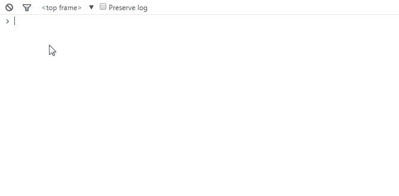

- [Console panel tips and tricks](#console-panel-tips-and-tricks)
  - [Working with the console](#working-with-the-console)
    - [Identify repeating console messages](#identify-repeating-console-messages)
    - [Clearing console](#clearing-console)
    - [Saving console output](#saving-console-output)
  - [Filtering console output](#filtering-console-output)
  - [Accessing elements](#accessing-elements)
    - [History of elements](#history-of-elements)
    - [Using inspect command](#using-inspect-command)
  - [Writing in the console](#writing-in-the-console)
    - [Writing in multiple lines](#writing-in-multiple-lines)
    - [Reference return value](#reference-return-value)
    - [Copy console objects](#copy-console-objects)
    - [Use format specifers](#use-format-specifers)
    - [Display console output in a table](#display-console-output-in-a-table)
    - [Conditional console output](#conditional-console-output)
    - [Group console messages](#group-console-messages)
    - [Get event listeners](#get-event-listeners)
    - [Monitor function invocations](#monitor-function-invocations)
    - [Track events](#track-events)
    - [Store console value to a variable](#store-console-value-to-a-variable)

# Console panel tips and tricks

  > Console panel is a very handy tool that lets you log messages throught javascript and can also serve as a javascript editor. The console has an **API** that provides a number of methods that make debugging easier. For starters, the *Console* can be used as a sandbox for learning **JavaScript**. You can open the console by opening the developer tools and clicking on the console tab.

## Working with the console
  You can write any valid javascript in the console and press enter and see the javascript get executed in console.

### Identify repeating console messages
  The console "stacks" the messages and shows a number in the left margin for repeating mesages. If you prefer a unique line entry for every log, enable Show timestamps from the DevTools settings.

### Clearing console
  You can clear the console by clicking on the clear console button on the left
  (Ctrl + L). You can also choose to preserve log by enaling the preserve log checkbox to presist the console history between page refreshes.
  
### Saving console output
  You can also right click on the console and choose *Save as* to save the output of the console to a log file.

## Filtering console output
Click the Filter button to filter console output. You can filter by severity level, by a regular expression, or by hiding network messages. Severity level filtering works as listed below :

| Option   |                                                              |
| ------   | ------------------------------------------------------------ |
| All	     | Shows all console output                                     |
| Errors   | Only show output from console.error().                       |
| Warnings | Only show output from console.warn().                        |
| Info     | Only show output from console.info().                        |
| Logs     | Only show output from console.log().                         |
| Debug	   | Only show output from console.timeEnd() and console.debug(). |

## Accessing elements
  You can select elements from the console using a number of commands as discussed below

  * $() - Short for document.querySelector(). Returns the first element, matching a CSS selector ( e.g. $('div') will return the first div element in the page).
  * $\$() - Short for document.querySelectorAll(). Returns an array of elements that match the given CSS selector.
  
    

### History of elements
  $0 - $4 - A history of the five most recent DOM elements that you've selected in the elements panel, $0 being the latest.
### Using inspect command
  You can use inspect() command to directly get an element in the elements panel. 

  ```
  Example - inspect($('your-selector'))
  ```

## Writing in the console

### Writing in multiple lines
  To write commands that span over multiple lines in the Console, press shift-enter

### Reference return value
  Use $_ to reference the return value of the previous operation executed in the Console
### Copy console objects
  Use the copy() command to copy text to your clipboard
  ```
  Example - copy(Object.keys(window))
  Output  - stores ["top", "window", "location", "external"... and so on
  ```
### Use format specifers
  You can also format specifiers in the first pararmeter of console.log() and pass parameters to replace the specifiers.
  ```
  Example - var number = 11 * 9;
            var color = 'red';
            console.log('%d %s balloons', number, color);
  Output  - 99 red balloons
  ```

  The following format specifiers are supported in the dev tools console.

  | Format Specifier | Description | 
  | ---------------- | ----------------------------------------------------------- |
  | %s               | String                                                      |
  | %d or %i         | Integer                                                     |
  | %f               | Floating point value                                        |
  | %o               | Expandable DOM element (as displayed in the ‘Elements’ tab of                       the dev tools)                                              |
  | %O               | Expandable JavaScript object                                |
  | %c	             | Formats the output using the CSS style you provide          |

  * Using %c we can style a console output.
    ```
    Example - console.log('%cThis text is styled!', 'color: #86CC00; background-color: blue; font-size: 20px; padding: 3px;')
    ```
    
### Display console output in a table
  You can use console.table() to output structured data as an interactive table in the console.
    
    
### Conditional console output
  You can use console.assert() to print a message to a console only when a particular condition fails i.e when the condition returns false.
  ```
  Example  - var count = 5;
              console.assert(count > 10, 'count is not larger than 10');
              // Prints "count is not larger than 10"
  ```
### Group console messages
  You can use the console.group() method to group together a series of log messages.  Once this method is called, any further log messages will be added to the group until console.groupEnd() is executed to close the group. You can specify an optional title to make it easier to find the group in the console
  
  ```
  Example  - console.group('Fetching Data');
              console.groupEnd();
  ```

### Get event listeners
  You can get all the registered event listeners for an oject by using the command getEventListeners(object)
  ```
  Example  - getEventListeners($('button'));
  ```
### Monitor function invocations
  You can track invocations for a function with the passed arguments using monitor(function).
### Track events 
  You can track an events of an object using monitorEvents(object, [events]) with the second parameter being optional.
    
  

  Use unmonitorEvents(object, [events]) to stop monitoring the event or use unmonitorEvents(object) to stop monitoring all events on the element.
### Store console value to a variable
  You can right-click on the value that's been logged to the console and select     "Store as Global Variable". This will store it in a variable called temp1 which we can access later 
    