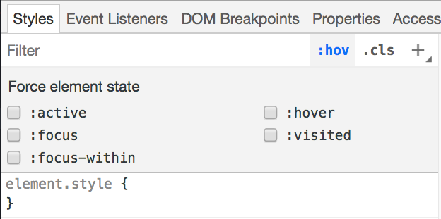
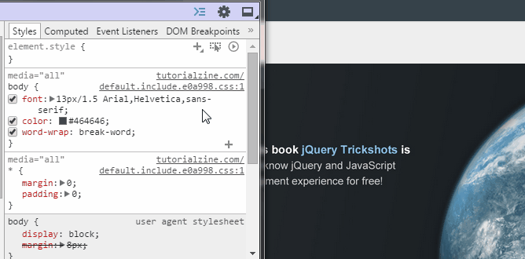
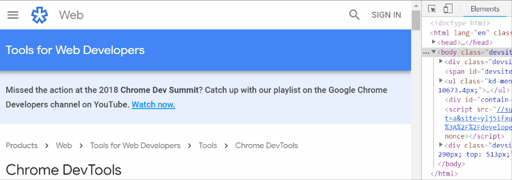

- [Elements panel tips and tricks](#elements-panel-tips-and-tricks)
  - [Add/edit HTML and its attributes](#addedit-html-and-its-attributes)
    - [Drag drop elements](#drag-drop-elements)
    - [Edit as HTML](#edit-as-html)
    - [Add classes](#add-classes)
    - [Hide and Remove elements](#hide-and-remove-elements)
  - [Add CSS and edit the Element state](#add-css-and-edit-the-element-state)
    - [Add a css selector](#add-a-css-selector)
    - [Triggering state](#triggering-state)
    - [Color picker](#color-picker)
  - [Finding an element](#finding-an-element)
    - [Scroll to view](#scroll-to-view)
  - [Finding where CSS is coming from](#finding-where-css-is-coming-from)
    - [Save CSS changes](#save-css-changes)
    - [View full CSS properties](#view-full-css-properties)
  - [Simulate Mobile Devices](#simulate-mobile-devices)
    - [Adding custom device presets](#adding-custom-device-presets)
    - [Toggle Orientation and agent type](#toggle-orientation-and-agent-type)
    - [Emulate geolocation](#emulate-geolocation)
    - [Cusotm orientation](#cusotm-orientation)

# Elements panel tips and tricks

  >  Elements panel is the first tab under chrome developer tools. It consists of the rendered **HTML** along with other useful tabs on the right hand side(*Styles, Computed, Properties, Event Listeners, DOM Breakpoints, Accessibility*) which are a great help to developers to debug a rendered web application. Listed down are a few tricks that can be used while using the elements panel.

  

## Add/edit HTML and its attributes

  Right click on an element from the DOM tree and click on add attribute to add a new attribute and see it rendered on the page. You can also edit an attribute by just clicking on it and editing it. 
### Drag drop elements
  You can drag and drop any HTML element and change its position across the page.
  
  
### Edit as HTML
  You can also edit the HTML by clicking on *Edit as HTML* and to directly edit in the console. You can also copy and make duplicates of a html element by clicking on copy and selecting copy element from the submenu and later using the paste element option to paste it at the required position.
### Add classes
  You can also add a new class to the selected element by selecting the .cls button on the right corner of the panel
    
### Hide and Remove elements
  Right click on an element and click on Hide Element to hide it or use the delete key from the keyboard to remove an element.

## Add CSS and edit the Element state

  On the right hand side of the panel there is a CSS tab which you can use to edit the CSS of any selected element by editing existing properties or adding any new properties.
### Add a css selector
  You can also click on the plus icon on the right corner to add a new selector for the selected element.
### Triggering state 
  You can trigger the state of a selected element by selecting the :hover button on the right corner to can see the styles applied when it’s active, hovered, on focus.
    
  

  You can also right click on the element and select force state to see how the element appears in active, hovered or focussed state.
### Color picker 
  You can use color picker also to hover on an element on the page and select colors with pixel accuracy.
    
  

## Finding an element 

  * Click the Inspect Element button (Ctrl+Shift+C)  on the top left corner of Chrome DevTools and hover over the control.
  * By using Ctrl+F, you can type in any string to match the source code or also use any CSS selectors to find the specific element.
  
    
### Scroll to view
  You can also right click on the element and select *Scroll to View* to view the element on the page.

## Finding where CSS is coming from

  You can use ctrl-click on Windows on a CSS property in the Elements panel, to view where the CSS is defined. 
### Save CSS changes
  You can also save any css changes made in the panel to file by clicking on the file name that you have edited.
### View full CSS properties
  You can also view all the css properties that are getting applied on the element, apart from those defined for the element by clicking on the computed panel.
  * The computed tab consists of CSS box model. You can also edit the values of margins, padding, border and height/width of the element by clicking on it
  * The tab also consists of a list of all css properties and their values for the selected element. You can also view the fonts on the page under *Rendered Fonts*

## Simulate Mobile Devices

  You can press on device icon on the left corner to toggle device toolbar. This toolbar will then help you to understand how the webpage will be rendered in different resolutions and across different devices.

  
### Adding custom device presets
    > You can add a custom device if you find an edge-case or niche device that isn't covered. To add a custom device:

    * Go to DevTools Settings.
    * Click the Devices tab.
    * Click Add custom device.
    * Enter a device name, width, height, device pixel ratio, and user agent string.
    * Click Add.
    * Your custom device is now available in the Device dropdown menu.
### Toggle Orientation and agent type
  You can also toggle the orientation between potrait and landscape by clicking the icon on the right.

  You can choose the user agent type and set it to either Mobile, Desktop or Desktop with touch
### Emulate geolocation
  You can emulate geolocation by selecting Geo location under sensors tab. To access the sensors click on the icon to the right corner to see more options, select *More Tools* and then select Sensors. In the window, change the dropdown value of Geolocation to override it. 

  
### Cusotm orientation
  You can also set custom orientation under the Sensors window by changing values of the orientation dropdown.

