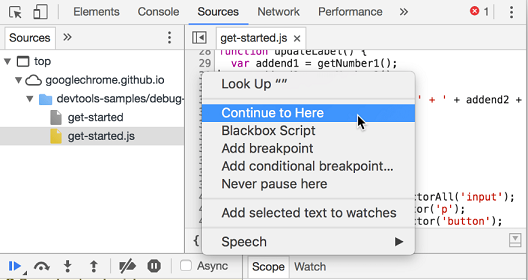

- [Sources panel tips and tricks](#sources-panel-tips-and-tricks)
  - [Working with source files and code](#working-with-source-files-and-code)
    - [Opening a file](#opening-a-file)
    - [Searching across files](#searching-across-files)
    - [Go to line number](#go-to-line-number)
    - [Beautify source code](#beautify-source-code)
    - [Edit mulitple line together](#edit-mulitple-line-together)
    - [Select next occurence](#select-next-occurence)
  - [Debugging source code](#debugging-source-code)
    - [Step over](#step-over)
    - [Step into](#step-into)
    - [Step out](#step-out)
    - [Continue to](#continue-to)
    - [Break on elements](#break-on-elements)
    - [Scope of the code](#scope-of-the-code)
    - [Blackbox a script](#blackbox-a-script)
    - [Break on XHR/fetch calls](#break-on-xhrfetch-calls)
    - [Stack trace](#stack-trace)
    - [Break on exceptions](#break-on-exceptions)
    - [Watch expressions](#watch-expressions)
    - [Add conditional and event breakpoints](#add-conditional-and-event-breakpoints)
  - [Debug snippets.](#debug-snippets)
    - [Stop before a function](#stop-before-a-function)
    - [Search for properties](#search-for-properties)
    - [Break on object property](#break-on-object-property)
    - [References](#references)


# Sources panel tips and tricks

## Working with source files and code
### Opening a file
  Press Ctrl + P (Cmd + P on Mac) when DevTools is opened, to quickly search for, and open any file in your project.
### Searching across files
  You can search in all files loaded on the page for a specific string, hit Ctrl + Shift + F (Cmd + Opt + F). This method of searching supports Regular expressions as well.
  
  
### Go to line number
  You can go to a specific line within the opened file by pressing Ctrl + G and then typing the line number.
   
  
### Beautify source code
  You can also beautify the code in a file by clicking on the pretty print button `{}` on the bottom left of the opened file.

   
### Edit mulitple line together
  You can edit multiple lines together in a CSS or a JS file (Eg. adding font-size to mutliple classes). Use (Ctrl+Click) to get multiple cursors and start typing to add the same line at multiple places.
### Select next occurence
  You can press Ctrl + D (Cmd + D) while editing files in the Sources Tab, to select the next occurrence of the current word as well, helping you edit them simultaneously
  
## Debugging source code 

  You can debug source code by setting up a debug point in an opened file by clicking on the line number. Once a debug point is setup you can debug the code by pausing and resuming the script execution.
    
### Step over
  When paused on a line of code containing a function that's not relevant to the problem you're debugging, click Step over  to execute the function without stepping into it.
### Step into
  When paused on a line of code containing a function call that is related to the problem you're debugging, click Step into  to investigate that function further.
### Step out
  When paused inside of a function that is not related to the problem you're debugging, click Step out  to execute the rest of the function's code
### Continue to
  Right-click the line of code that you're interested in, and select Continue to here. DevTools runs all of the code up to that point, and then pauses on that line.

  
### Break on elements
  You can right-click a HTML element on the page, to setup a breakpoint that will be triggered when that page element is modified

  

  - subtree modifications: the breakpoint is triggered if the element or any of its sub-elements is modified. This is the most frequently used option.
  - Attribute modifications: the breakpoint is triggered when an attribute of the element is changed
  - Node removal: triggered when the element is removed from the document

### Scope of the code 
  While paused on a line of code, use the Scope pane to view and edit the values of properties and variables in the local, closure, and global scopes.
  Double-click a property value to change it.

  
### Blackbox a script
  You can blackbox a script when you want to ignore that script while debugging
  ```
  Example  - function animate() {
                prepare();
                lib.doFancyStuff(); // A
                render();
              }
  Suppose A is a third party plugin and you do not want to debug it you can right click on the line and select Blackbox Script to ignore the scrpit while debugging 
  ```
### Break on XHR/fetch calls
  You can activate breakpoint to find out which part of code is making an XHR call by selecting *Any XHR* under the XHR/fetch breakpoints.

  Alternatively, by clicking the plus sign on the section header, it's possible to add an ajax breakpoint that breaks only if the URL of the request contains a matching string.
### Stack trace  
  You can use the Call Stack pane to view the call stack that got you to this point,  while paused on a line of code.

  
  You can also copy the stack trace by right clicking on the stack trace section.
### Break on exceptions
  The Chrome Dev Tools allow having the debugger stop everytime that an exception is thrown. This can be activated using the pause button in the sources tab. The checkbox just below it allows to pause the debugger only if the exception is uncaught.
### Watch expressions
  You can use the Watch pane to watch the values of custom expressions. You can watch any valid JavaScript expression. Select a piece of code and then click the plus icon under Watch expression to add a watch on the variable. The value gets updates while stepping through code.

  
### Add conditional and event breakpoints
  You can right click on a line number while debugging code to edit the breakpoint and add any conditions so that the breakpoint will be triggered only when the condition returns true.

  You can also set breakpoints on all sort of events in the *Event Listener Breakpoints* section.

## Debug snippets.

  The Chrome Dev Tools give the developer the possibility to save a small script for future use. This functionality is available on the sources tab, on the sub-tab Snippets.

  You can add snippets od code into your dev tools by addind a snippet and use them anytime while deugging your code.
### Stop before a function
  Add a breakpoint before a given function
  The stopBefore.js snippet allows to setup a breakpoint that is triggered just before a certain function is called.
  ```
  For example, this will trigger a breakpoint just before the document.getElementById function is called
  stopBefore(document, 'getElementById')
  ```
### Search for properties 
  Search an object for matching properties
  The grep.js snippet allows searching an object and its prototypical chain for properties that match a given search criteria.

  ```
  For example this instruction will search for all properties matching get in the document object:

  grep(document, 'get');
  ```
### Break on object property
  Break when an object property is accessed
  The debugAccess.js snippet allows to trigger a breakpoint when a given property is accessed.
  ```
  For example this will trigger a breakpoint each time document.cookie is called:

  debugAccess(document, 'cookie');
  ```
### References
  There are many other popular snippets available which you can readily use across the web. Listing down here few useful links.
  - https://github.com/paulirish/devtools-addons/wiki/Snippets
  - https://bgrins.github.io/devtools-snippets


