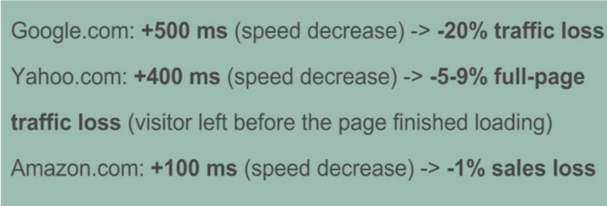

## Web Performance

*Web performance* refers to the speed in which web pages are downloaded and displayed on the user's web browser. **Web performance optimization (WPO)**, or **website optimization** is the field of knowledge about increasing web performance.

> Websites are critically important for a business because they create a positive or negative impression of your products, goods, services…image of your brand. And as we know websites are visited even though the actual purchase can be made in store. Therefore, a website should be user-friendly, intuitive, and easy to navigate. Moreover, it should be optimized for various kinds of mobile devices and site traffic. But quite often in the process of putting up a website, we’re so busy focusing on the big stuff like design, content, and digital marketing that we forget one of the most fundamental parts of keeping that business site operational and fast: website performance optimization. Actually, speed is a critical element of running a successful website and should always be a priority for website managers. Faster loading websites benefit from better user engagement, higher conversion rates, higher SEO rankings and much more.    

  
##  Web Performance Optimization overview

Web performance optimization is always something that should be a top priority, especially when there is so much online competition.   
  > “80-90% of the end-user response time is spent on the front end. start there.” - Steve Souders 

It is a very well know fact that faster website download speeds have been shown to increase visitor retention and loyalty, user satisfaction, especially for users with slow internet connections and those on mobile devices!  

 