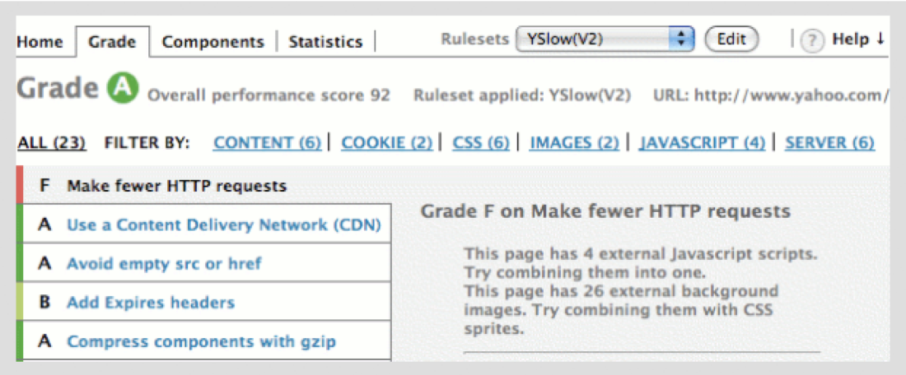
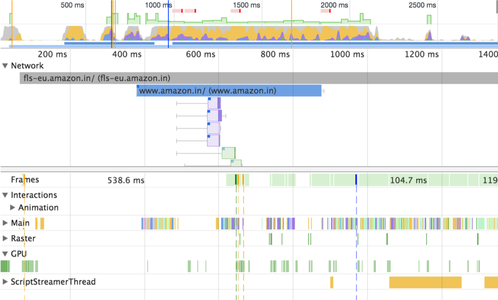

## **YSlow Performance Rules**

1. Minimize HTTP Requests
2. Use a Content Delivery Network
3. Avoid empty src or href
4. Add an Expires or a Cache-Control Header
5. Gzip Components
6. Put StyleSheets at the Top
7. Put Scripts at the Bottom
8. Avoid CSS Expressions
9. Make JavaScript and CSS External
10. Reduce DNS Lookups
11. Minify JavaScript and CSS
12. Avoid Redirects
13. Remove Duplicate Scripts
14. Configure ETags
15. Make AJAX Cacheable
16. Use GET for AJAX Requests
17. Reduce the Number of DOM Elements
18. No 404s
19. Reduce Cookie Size
20. Use Cookie-Free Domains for Components
21. Avoid Filters
22. Do Not Scale Images in HTML
23. Make favicon.ico Small and Cacheable

## **YSlow Extension**

## **Google Speed Rules**

1. Avoid landing page redirects
2. Enable compression
3. Improve server response time
4. Leverage browser caching
5. Minify resources
6. Optimize images
7. Optimize CSS Delivery
8. Prioritize visible content
9. Remove render-blocking JavaScript
10. Use asynchronous scripts

## **Chrome Dev Tools**

### **Network , Performance , Audits**

 