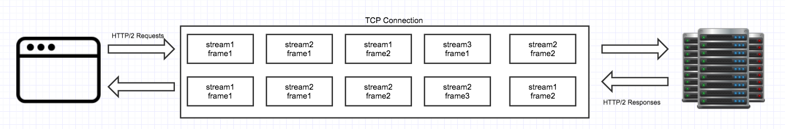
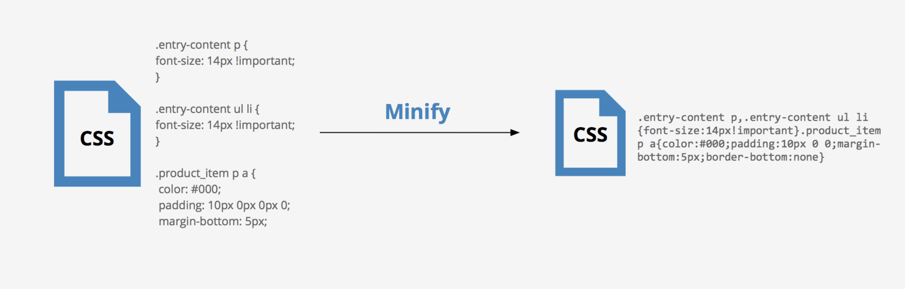
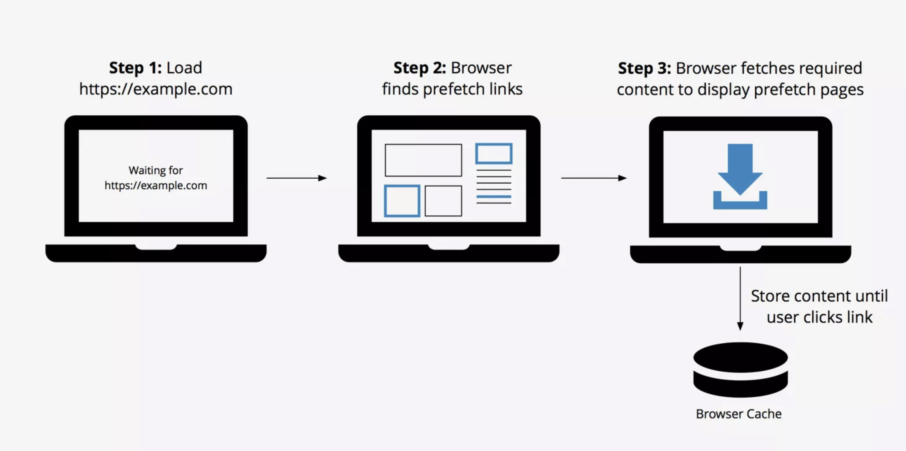
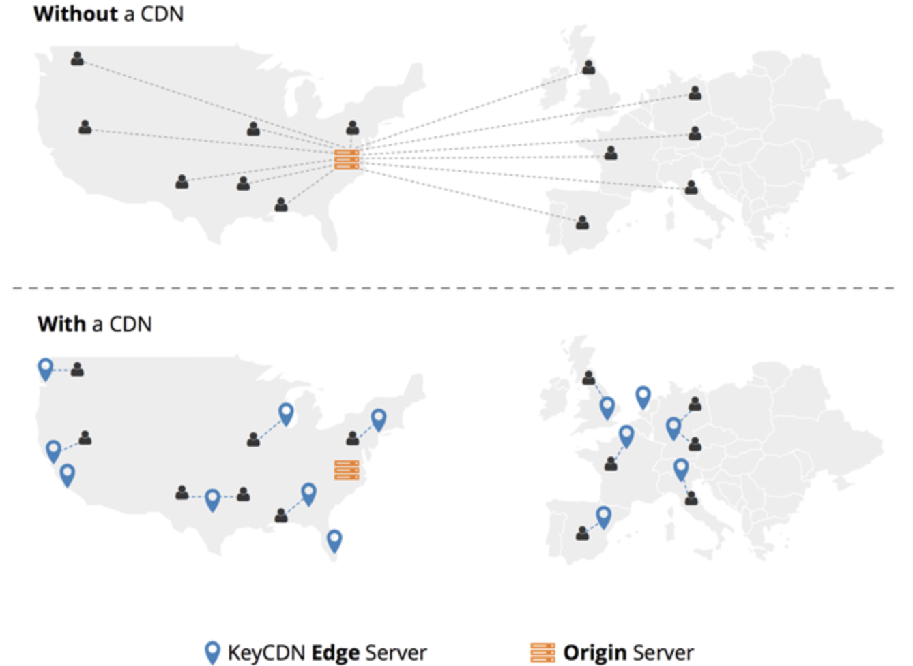
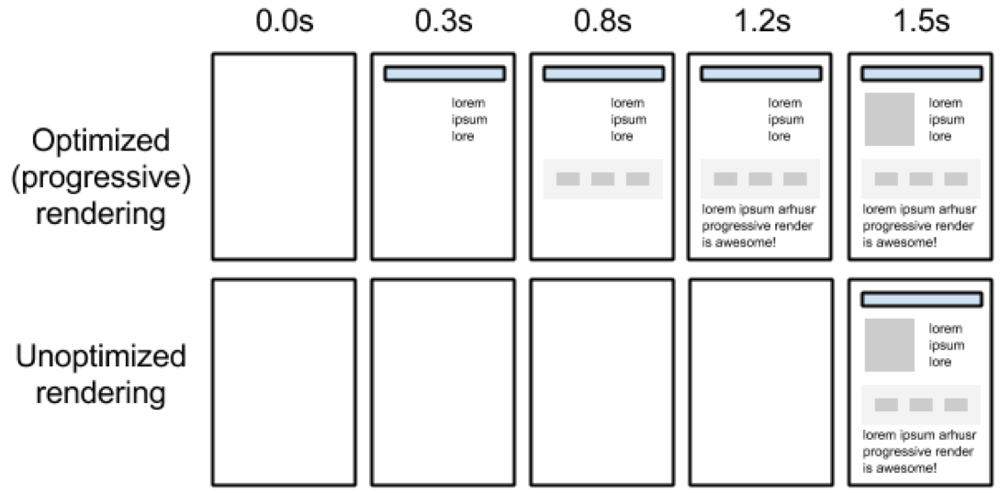

# Web Performance Optimization Techniques

## **1. Clean up the HTML Document**
  
  HTML, or hypertext markup language, is the backbone of nearly every website. HTML allows you to format webpages with headings, subheadings, lists, and other useful text-organizing features. With the most recent updates in HTML5, you can also create attractive graphics.

HTML can be easily read by web crawlers, so search engines can be updated with your website’s content in a timely manner. When dealing with HTML, you should strive to write in a manner that is both concise and effective. Additionally, when it comes to referencing other resources within your HTML document there are a few best practices you should follow.

### **Proper CSS Placement**

Web designers tend to create CSS stylesheets after the main HTML skeleton of a webpage has been created. As such, CSS components are sometimes placed near the bottom of the document. However, it is recommended to put CSS at the top of your HTML document’s header in order to ensure progressive rendering.

```
<head>
<link href='https://yourwebsite.com/css/style.css' rel='stylesheet' type='text/css'>
</head>
```

This strategy will not improve the loading speeds of your website, but it will keep your visitors from waiting on blank screens or seeing a flash of unstyled text (FOUT). If most of your webpage’s visual elements are already loaded, visitors will be more likely to wait for the entire page to load, thus improving your front end optimization. 

### **Proper Javascript Placement**

On the other hand, if you place JavaScript attributes within the head tag or near the top of the HTML document, you will block the loading process of HTML and CSS elements. This mistake can cause visitors wait on a blank page, and therefore may impatiently abandon your site. You can avoid this issue by placing JavaScript attributes at the bottom of your HTML.


While HTML is one of the most valuable tools available to web designers, it is often used with CSS and JavaScript attributes that can slow down your webpage. CSS and JavaScript attributes can transform your webpages for the better, but you should take special care and use them appropriately. A good practice with CSS and JavaScript is to avoid embedding the code. When you embed code, you place CSS in a style tag, and you use JavaScript in script tags. This increases the amount of HTML code that must be loaded each time your webpage is refreshed.

### **Combining Files? Don’t Bother**

In the past, you may have combined frequently used CSS scripts into a single file so that you could simply reference one file within your HTML code instead of many. This was a sound practice when using the HTTP1.1 protocol, however is no longer necessary.

Thanks to HTTP/2, you can now take advantage multiplexing to send and receive HTTP requests and responses asynchronously via a single TCP connection.

This means that you no longer need to tediously combine scripts into a single file.


  


## **2. Reduce External HTTP Requests**

In many cases, a large portion of a website’s load time comes from external HTTP requests. The speed at which an external resource loads can vary depending on the hosting provider’s server infrastructure, location, etc. Your first goal when reducing external HTTP requests should be to examine your website with a minimalist outlook. Study each component of your webpages, and **eliminate any features that do not improve the experience of your visitors**. These features may be:

* Unnecessary images
* Unnecessary JavaScript
* Excessive CSS
* Unnecessary plugins

## **3. Minify CSS, JS and HTML**


 
Minification techniques can help you eliminate unnecessary characters within a file. When you are writing code in an editor, you likely use indentations and notes. These methods certainly keep your code clean and readable, but they also add extra bytes to your document.

For example, this is a code snippet before minification is applied.

```
.entry-content p {
font-size: 14px !important;
}

.entry-content ul li {
font-size: 14px !important;
}

.product_item p a {
 color: #000;
 padding: 10px 0px 0px 0;
 margin-bottom: 5px;
 border-bottom: none;
}

```

And here is the same snippet after minification has been applied.

```
.entry-content p,.entry-content ul li{font-size:14px!important}.product_item p a{color:#000;padding:10px 0 0;margin-bottom:5px;border-bottom:none}

```

## **4. Enable Prefetching**



Prefetching can improve your visitors’ browsing experience by fetching necessary resources and related data before they are needed. There are 3 main types of prefetching:

*Link Prefetching
*DNS Prefetching
*Prerendering

With prefetching, the URL, CSS, images, and JavaScript are gathered for each link before you even leave your current webpage. This ensures that visitors can use links to navigate between pages with minimal loading times.

Fortunately, prefetching is easy to enable. Depending upon the type of prefetching you want to enable, you can simply add the rel="prefetch", rel="dns-prefetch", or rel="prerender" tag to your link attributes within your website’s HTML.


## **5. Increase Speed With a CDN and Caching**

You can significantly improve the speed and performance of your website by using a content delivery network. When you use a CDN, you link your website’s static content to an extended network of servers across the globe. This is especially important if your website caters to a global audience. The CDN allows your site’s visitors to load data from their nearest server. If you use a CDN, your site’s files will automatically be compressed for rapid delivery across the globe.



A CDN is one method of caching that can greatly help improve the delivery times of your assets, however, there are other caching techniques that you can implement as well - one of which is to leverage browser caching.

Properly setting up browser caching allows your browser to store certain files within its own cache to be delivered faster. Configuring this method can be done directly within your origin server’s configuration file.


## **6. Compress Your Files**


While many CDN services will compress your files for you, if you don’t use a CDN consider using a file compression method on your origin server to improve your front end optimization. File compression will make your site’s content light and easy to manage. One of the most commonly used file compression methods is Gzip. This is an excellent method for shrinking documents, audio files, PNG images, and other bulky files that have not already been compressed.


## **7. Optimize Your Images**

For people who are unaccustomed to the ways of front end optimization, images can be a website-killer. Massive photo albums and large high-resolution images on your site can jam the rendering process. High-definition images that are not optimized can weigh several megabytes. Therefore, properly optimizing these will allow you to improve your site’s front end performance.

Each image file contains a trove of information that isn’t related to the actual photograph or picture. For JPEG photographs, the file contains dates, locations, camera specifications, and other irrelevant information. You can streamline an image’s lengthy loading process by deleting this extra image data with optimization tools such as Optimus. Optimus uses smart compression in that it uses losslessly optimizes PNG images.


On the other hand, Optimus uses slight lossy compression for JPEG images. Although lossy compression actually removes additional data from the image, the Optimus lossy compression settings are defined at a level where the user will see no visible quality loss. This allows users to save big on file sizes while maintaining high-quality images.


## **8. Critical Rendering Path**

Displaying web pages fast enough to meet user expectations is still a major challenge. Content caching, low-latency web hosting, image optimization, and other techniques can decrease page load time significantly, but not always fast enough. To solve this problem, developers optimize the critical rendering path to make the website immediately usable "above the fold" while the rest of the page loads.



### **How Critical Rendering Path Works**

The critical rendering path (CRP) looks at the sequence of steps the browser takes to receive HTML, CSS, and JavaScript bytes, as well as the techniques required to render the initial view of the web page. Steps involved in rendering the page include constructing the object model, constructing and painting the layout, and adding interactivity with JavaScript. Developers tweak parts of these steps to load critical objects that let users see "initial view content" quicker.

To set up the critical path:

1. Analyze the website and determine the critical resources needed for the initial view
2. Remove or defer elements not required for above-the-fold content
3. Compress and optimize the required resources to reduce page size as much as possible
4. Squeeze all the optimized HTML and CSS information required for the initial view in the first data packet

It takes about one second to download and display the first data packet, making above-the-fold content appear almost instantly. The earlier deferred elements are then downloaded and displayed after the initial view.


### **How to Optimize Critical Rendering Path**

First you need to know which assets are needed for generating content above the fold. After you determine this, optimize the critical rendering path as follows:

### 1. Minimize the number of critical resources
  Critical resources are those that may block the initial rendering of a page. The fewer critical resources on a page, the less work the browser has to do to display the content on the screen. Critical resources can be minimized by eliminating them, deferring their download, or making them load asynchronously.

### 2. Minimize the number of critical bytes
Minimize the amount of critical bytes by compressing and optimizing each resource. You can further optimize these resources by making use of HTML and CSS obfuscation.

### 3. Minimize the critical path length
The critical path length is the number of round trips between the browser and the host of the assets (from request, to response, to retrieval). To shorten the critical path length or the number of round trips, download all critical resources as early as possible.


